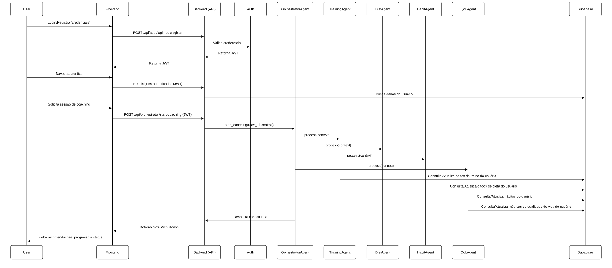

# Gym Assistant MCP (Fullstack)

## Visão Geral

O **Gym Assistant** é uma plataforma fullstack para orquestração de múltiplos agentes de IA voltados à saúde, treino, dieta, hábitos e qualidade de vida. Utiliza o protocolo MCP (Model Context Protocol) para coordenar agentes especializados, fornecendo recomendações personalizadas, acompanhamento de progresso e integração de dados de saúde.

- **Frontend:** React + TailwindCSS + Recharts
- **Backend:** FastAPI + Supabase + JWT Auth
- **Objetivo:** Automatizar recomendações e acompanhamento de saúde, dieta, treino e hábitos de forma integrada e segura.

---

## Diagrama de Fluxo MCP (Sequence Diagram)



---

## Quick-start

### 1. Setup Local (Windows/Linux/Mac)

#### Pré-requisitos
- Python 3.9+
- Node.js 18+
- [Poetry](https://python-poetry.org/) ou `virtualenv`
- Conta no [Supabase](https://supabase.com/)

#### Passos Backend

```bash
# Clone o repositório
git clone https://github.com/lauroPereira/gym-assistant.git
cd gym-assistant/backend

# Crie e ative o virtualenv
python -m venv .venv
# Windows
.venv\Scripts\activate
# Linux/Mac
source .venv/bin/activate

# Instale as dependências
pip install -r requirements.txt

# Configure o .env
cp .env.example .env
# Edite .env com as chaves do Supabase e JWT

# Inicialize o banco (opcional, para ambiente local)
python scripts/init_db.py

# Rode o servidor
uvicorn backend.app:app --reload
```

Acesse a documentação do backend em [http://localhost:8000/docs](http://localhost:8000/docs).

#### Passos Frontend

```bash
cd ../frontend

# Instale as dependências
npm install

# Rode o frontend
npm start
```

Acesse o frontend em [http://localhost:3000](http://localhost:3000)

> O frontend está configurado para proxyar requisições API para `http://localhost:8000`.

---

### 2. Deploy Vercel (Frontend) & Vercel/Render/Fly.io (Backend)

#### Backend
1. Crie um projeto em [Render](https://render.com/), [Fly.io](https://fly.io/) ou similar.
2. Configure as variáveis de ambiente (`SUPABASE_URL`, `SUPABASE_KEY`, `JWT_SECRET`).
3. Faça deploy do diretório `backend`.

#### Frontend
1. Crie um projeto no [Vercel](https://vercel.com/).
2. Configure a variável de ambiente `REACT_APP_API_URL` (se necessário) para o endpoint do backend.
3. Faça deploy do diretório `frontend`.

---

## Estrutura de Pastas e Responsabilidades

```
gym-assistant/
│
├── backend/
│   ├── app.py                  # Entry point FastAPI
│   ├── core/                   # Config, auth, database
│   ├── api/                    # Rotas REST (MCP, auth, orquestrador)
│   ├── agents/                 # Agentes especialistas e orquestrador
│   ├── models/                 # Schemas Pydantic e modelos do banco
│   ├── scripts/                # Scripts utilitários (ex: init_db)
│   ├── requirements.txt        # Dependências Python
│   └── .env.example            # Exemplo de variáveis de ambiente
│
├── frontend/
│   ├── package.json            # Dependências e scripts npm
│   ├── public/                 # index.html e assets públicos
│   ├── src/
│   │   ├── App.js              # Entry point React
│   │   ├── index.js            # Bootstrap React
│   │   ├── components/         # Componentes reutilizáveis (ex: AgentCard, Layout)
│   │   ├── pages/              # Páginas principais (Dashboard, Login, Register, Agents)
│   │   └── contexts/           # Contextos globais (ex: AuthContext)
│   ├── tailwind.config.js      # Configuração do TailwindCSS
│   └── postcss.config.js       # Configuração do PostCSS
│
├── .env.example                # Exemplo de variáveis globais
└── README.md                   # Documentação geral do projeto
```

### Resumo dos módulos

- **backend/**: API REST, autenticação, lógica de agentes, integração Supabase.
- **frontend/**: SPA React, dashboard, autenticação, visualização de métricas e cards de agentes.