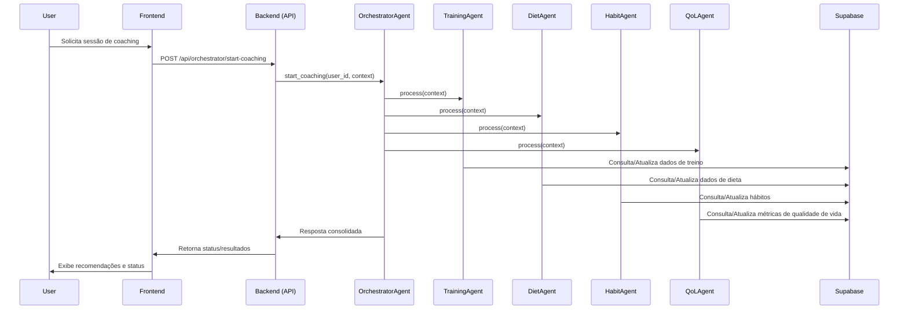

# Gym Assistant MCP Backend

## Visão Geral

O **Gym Assistant** é um sistema de orquestração de múltiplos agentes de IA para auxiliar usuários em saúde, treino, dieta, hábitos e qualidade de vida. Utiliza o protocolo MCP (Model Context Protocol) para coordenar agentes especializados, fornecendo recomendações personalizadas, acompanhamento de progresso e integração de dados de saúde.

- **Stack**: FastAPI, Supabase, JWT Auth, múltiplos agentes de IA.
- **Objetivo**: Automatizar recomendações e acompanhamento de saúde, dieta, treino e hábitos de forma integrada e segura.

---

## Diagrama de Fluxo MCP (Sequence Diagram)



---

## Quick-start

### 1. Setup Local (Windows/Linux/Mac)

#### Pré-requisitos
- Python 3.9+
- [Poetry](https://python-poetry.org/) ou `virtualenv`
- Node.js (para frontend, opcional)
- Conta no [Supabase](https://supabase.com/)

#### Passos

```bash
# Clone o repositório
git clone https://github.com/lauroPereira/gym-assistant.git
cd gym-assistant/backend

# Crie e ative o virtualenv
python -m venv .venv
# Windows
.venv\Scripts\activate
# Linux/Mac
source .venv/bin/activate

# Instale as dependências
pip install -r requirements.txt

# Configure o .env
cp .env.example .env
# Edite .env com as chaves do Supabase e JWT

# Inicialize o banco (opcional, para ambiente local)
python scripts/init_db.py

# Rode o servidor
uvicorn backend.app:app --reload
```

Acesse a documentação em [http://localhost:8000/docs](http://localhost:8000/docs).

---

### 2. Deploy Vercel

1. Crie um projeto no [Vercel](https://vercel.com/).
2. Configure as variáveis de ambiente do backend (`SUPABASE_URL`, `SUPABASE_KEY`, `JWT_SECRET`).
3. O frontend pode ser hospedado separadamente; configure o endpoint do backend nas variáveis do frontend.

---

## Estrutura de Pastas e Responsabilidades

```
backend/
│
├── app.py                  # Entry point FastAPI
├── core/
│   ├── config.py           # Configurações e settings
│   ├── database.py         # Inicialização e conexão com Supabase
│   └── auth.py             # Autenticação e dependências JWT
│
├── api/
│   ├── routes/
│   │   ├── mcp.py          # Rotas MCP
│   │   ├── auth.py         # Rotas de autenticação
│   │   └── orchestrator.py # Rotas do orquestrador e agentes
│   └── dependencies.py     # Dependências globais de API
│
├── agents/
│   ├── orchestrator_agent.py # Lógica de orquestração MCP
│   ├── training_agent.py     # Agente de treino
│   ├── diet_agent.py         # Agente de dieta
│   ├── habit_agent.py        # Agente de hábitos
│   └── qol_agent.py          # Agente de qualidade de vida
│
├── models/
│   ├── schemas.py           # Schemas Pydantic (request/response)
│   └── db_models.py         # Modelos de banco (opcional)
│
├── scripts/
│   └── init_db.py           # Script de criação de tabelas e dados iniciais Supabase
│
├── requirements.txt         # Dependências Python
└── .env.example             # Exemplo de variáveis de ambiente
```

### Resumo dos módulos

- **core/**: Configuração, autenticação, conexão com banco.
- **api/routes/**: Rotas REST (MCP, auth, orquestrador).
- **agents/**: Implementação dos agentes especialistas e orquestrador.
- **models/**: Schemas de dados e modelos do banco.
- **scripts/**: Scripts utilitários (ex: inicialização do banco).
- **requirements.txt**: Dependências do backend.

---

Se precisar de instruções para o frontend ou integração, posso complementar! Se quiser o README em inglês, só avisar.
